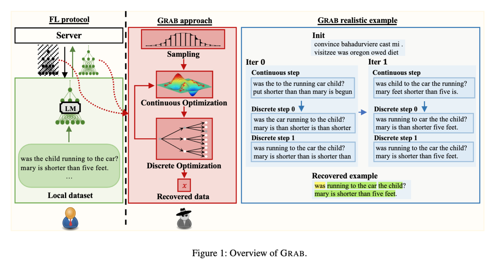

# GRAB: Uncovering Gradient Inversion Risks in Practical Language Model Training

<h2> Environment setup </h2>
<h3>Install the conda environment with the following commands one by one:</h3>
 
<code>conda create -n GRAB python=3.9.4</code>
 
<code>conda activate GRAB</code>
 
<code>pip install torch==2.0.1+cu118 --index-url https://download.pytorch.org/whl/cu118</code>
 
<code>pip install transformers==4.34.1 joblib==1.3.2 numpy==1.26.4 datasets==1.16.1</code>

<h2> Experiments </h2>

<h3> Benchmark Settings (Figure 2 in paper)</h3>

<h4>GRAB</h4>

To run our attack, from the root directory
 
<code>cd main_attack</code>

Create symbolic link of utils.
 
<code>ln -s ../utils utils</code>

Run the attack with the following command.
 
<code>python bert_benchmark_attack.py --device DEVICE --model MODEL --dataset DATASET --batch_size BATCH_SIZE
--parallel --run RUN</code>

--device: the device to run experiments on, e.g. cuda:0
 
--model: the model to be attacked. Only use bert-base-uncased.
 
--dataset: the dataset for experiments. Only use cola, sst2, or rotten_tomatoes.
 
--batch_size: the batch size for experiments. Choose from 1 to 32.
 
--parallel: whether to use parallel computing in discrete optimization.
 
--run: the number of runs for each experiment. Use first, second, or third.

The results will be saved in <code>results/benchmark/DATASET</code> from root directory. Make sure you create these
folders before running the experiments.

In our experiments, we do not set a fixed random seed and run the experiments three times by changing the <code>
--run</code> parameter between first, second and third.

To evaluate the results, go back to the root directory and run the following command.
 
<code>python evaluation.py --model MODEL --dataset DATASET --batch_size BATCH_SIZE --setting SETTING</code>

--setting: the setting for evaluation. Only use benchmark here.

As mentioned above, we run the experiments three times. If you only wish to run the experiment once and evaluate the
result, you can change line 25 in the evaluation script to keep "first" only.

<h4>Baselines</h4>
To run baseline attacks, from the root directory, go to the baselines folder.
 
<code>cd baselines/lamp</code>

Create the environment and download the required files provided by LAMP.
 
<code>conda env create -f environment.yml</code>
 
<code>conda activate lamp</code>
 
<code>wget -r -np -R "index.html*" https://files.sri.inf.ethz.ch/lamp/ </code>
 
<code>mv files.sri.inf.ethz.ch/lamp/* ./ </code>
 
<code>rm -rf files.sri.inf.ethz.ch </code>

We modify some of the code of the original implementation, such as the datasets loader, to make it compatible with our
evaluation.

To run DLG attack, run the following command.
 
<code>python attack.py --baseline --dataset DATASET --split test --loss dlg --n_inputs N_INPUTS -b BATCH_SIZE --lr 0.1
--lr_decay 1 --bert_path MODEL --n_steps 2500 --run RUN</code>

--n_inputs: The number of batches. Our selected datasets have 64 samples. This should be 64/batch_size.
 
--run: the number of runs for each experiment. Use first, second, or third.

To run the TAG attack, run the following command.
 
<code>python attack.py --baseline --dataset DATASET --split test --loss tag --n_inputs N_INPUTS -b BATCH_SIZE --lr 0.1
--lr_decay 1 --tag_factor 0.01 --bert_path MODEL --n_steps 2500 --run RUN</code>

To run the LAMP_COS attack, run the following command.
 
<code>python attack.py --dataset DATASET --split test --loss cos --n_inputs N_INPUTS -b BATCH_SIZE --coeff_perplexity
0.2 --coeff_reg 1 --lr 0.01 --lr_decay 0.89 --bert_path MODEL --n_steps 2000 --run RUN</code>

To run the LAMP_L1L2 attack, run the following command.
 
<code>python attack.py --dataset DATASET --split test --loss tag --n_inputs N_INPUTS -b BATCH_SIZE --coeff_perplexity 60
--coeff_reg 25 --lr 0.01 --lr_decay 0.89 --tag_factor 0.01 --bert_path MODEL --n_steps 2000 --run RUN</code>

The results will be saved to <code>results/benchmark/METHOD/DATASET</code> from the <code>lamp</code> folder.
Make sure you create these folders
before running the experiments.

To evaluate the results, go back to the <code>lamp</code> folder and run the following command.
 
<code>python evaluation.py --model MODEL --dataset DATASET --batch_size BATCH_SIZE --setting SETTING --method
METHOD</code>

--method: the method being evaluated. Choose from dlg, tag, lamp_cos, and lamp_l1l2.

Similar to our attack, we run the experiments three times. If you only wish to run the experiment once and evaluate the
result, you can change line 25 in the evaluation script to keep "first" only.

For more information on the baseline attacks, check out the LAMP repository:
<code>https://github.com/eth-sri/lamp </code>

<h3> Practical Settings (Figure 3 in paper) </h3>

<h4>GRAB</h4>

From the root directory, go to the <code>main_attack</code> folder, activate the GRAB environment and run the attack
with the following command.
 
<code>python bert_practical_attack.py --device DEVICE --model MODEL --dataset DATASET --batch_size BATCH_SIZE
--parallel</code>

The results will be saved in <code>results/practical/DATASET</code> from root directory. Make sure you create these
folders before running the experiments.

To evaluate the results, go back to the root directory and run the following command.
 
<code>python evaluation.py --model MODEL --dataset DATASET --batch_size BATCH_SIZE --setting SETTING</code>

--setting: the setting for evaluation. Only use practical here.

To run our attack without dropout mask learning, from the root directory, go to the <code>main_attack</code> folder,
activate the GRAB environment and run the attack with the following command.

<code>python bert_practical_attack.py --device DEVICE --model MODEL --dataset DATASET --batch_size BATCH_SIZE
--parallel</code>

The results will be saved in <code>results/practical_no_DL/DATASET</code> from root directory. Make sure you create
these
folders before running the experiments.

To evaluate the results, go back to the root directory and run the following command.
 
<code>python evaluation.py --model MODEL --dataset DATASET --batch_size BATCH_SIZE --setting SETTING</code>

--setting: the setting for evaluation. Only use practical_no_DL here.

<h4>Baselines</h4>

From the root directory, go to the <code>baselines/lamp</code> folder, activate the LAMP environment.

We modify some of the code of the original implementation to turn off the embedding layer learning and activate the
dropout to make it compatible with the practical settings.

To run DLG attack, run the following command.
 
<code>python attack_practical.py --baseline --dataset DATASET --split test --loss dlg --n_inputs N_INPUTS -b BATCH_SIZE
--lr 0.1
--lr_decay 1 --bert_path MODEL --n_steps 2500 --run RUN</code>

--n_inputs: The number of batches. Our selected datasets have 64 samples. This should be 64/batch_size.
 
--run: the number of runs for each experiment. Use first, second, or third.

To run the TAG attack, run the following command.
 
<code>python attack_practical.py --baseline --dataset DATASET --split test --loss tag --n_inputs N_INPUTS -b BATCH_SIZE
--lr 0.1
--lr_decay 1 --tag_factor 0.01 --bert_path MODEL --n_steps 2500 --run RUN</code>

To run the LAMP_COS attack, run the following command.
 
<code>python attack_practical.py --dataset DATASET --split test --loss cos --n_inputs N_INPUTS -b BATCH_SIZE
--coeff_perplexity
0.2 --coeff_reg 1 --lr 0.01 --lr_decay 0.89 --bert_path MODEL --n_steps 2000 --run RUN</code>

To run the LAMP_L1L2 attack, run the following command.
 
<code>python attack_practical.py --dataset DATASET --split test --loss tag --n_inputs N_INPUTS -b BATCH_SIZE
--coeff_perplexity 60
--coeff_reg 25 --lr 0.01 --lr_decay 0.89 --tag_factor 0.01 --bert_path MODEL --n_steps 2000 --run RUN</code>

The results will be saved to <code>results/practical/METHOD/DATASET</code> from the <code>lamp</code> folder.
Make sure you create these folders
before running the experiments.

To evaluate the results, go back to the <code>lamp</code> folder and run the following command.
 
<code>python evaluation.py --model MODEL --dataset DATASET --batch_size BATCH_SIZE --setting SETTING --method
METHOD</code>

--setting: the setting for evaluation. Only use practical here.
--method: the method being evaluated. Choose from dlg, tag, lamp_cos, and lamp_l1l2.

Similar to our attack, we run the experiments three times. If you only wish to run the experiment once and evaluate the
result, you can change line 25 in the evaluation script to keep "first" only.

For more information on the baseline attacks, check out the LAMP repository:
<code>https://github.com/eth-sri/lamp </code>

<h3> Ablation Studies </h3>

<h4>Model Sizes/Types (Table 3 in paper)</h4>

To run GRAB on bert-tiny, from the root directory, go to the <code>ablation</code> folder, activate the GRAB
environment, and run the following commands.

<code>python bert_tiny_practical_attack.py --run RUN</code>

<code>python bert_tiny_practical_no_DL_attack.py --run RUN</code>

The results will be saved in results/ablation/bert_tiny/practical and results/ablation/bert_tiny/practical_no_DL from
root directory. Make sure you create these folders before
running the experiments.

To run the evaluation, go back to the root directory and run the following command.

<code>python evaluation.py --ablation bert_tiny --setting SETTING --run RUN</code>

--setting: the setting for evaluation. Use either practical or practical_no_DL.

To run GRAB on bert-large, from the root directory, go to the <code>ablation</code> folder, activate the GRAB
environment, and run the following commands.

<code>python bert_large_practical_attack.py --run RUN</code>

<code>python bert_large_practical_no_DL_attack.py --run RUN</code>

The results will be saved in results/ablation/bert_large/practical and results/ablation/bert_large/practical_no_DL from
root directory. Make sure you create these folders before
running the experiments.

To run the evaluation, go back to the root directory and run the following command.

<code>python evaluation.py --ablation bert_large --setting SETTING --run RUN</code>

--setting: the setting for evaluation. Use either practical or practical_no_DL.

To run GRAB on RoBERTa_base, RoBERTa_tiny, and RoBERTa_large, from the root directory, go to the <code>ablation</code>
folder, activate the GRAB
environment, and run the following commands.

<code>python roberta_base_practical_attack.py --run RUN</code>

<code>python roberta_tiny_practical_attack.py --run RUN</code>

<code>python roberta_large_practical_attack.py --run RUN</code>

<code>python roberta_base_practical_no_DL_attack.py --run RUN</code>

<code>python roberta_tiny_practical_no_DL_attack.py --run RUN</code>

<code>python roberta_large_practical_no_DL_attack.py --run RUN</code>

The results and the evaluation will follow similar patterns. Please refer to previous sections.

To run baselines on bert-tiny and bert-large, from the root directory, go to the baselines/lamp folder, activate the
LAMP environment.

To run DLG attack, run the following command.

<code>python attack_tiny_practical.py --baseline --dataset DATASET --split test --loss dlg --n_inputs N_INPUTS -b
BATCH_SIZE --lr 0.1 --lr_decay 1 --bert_path MODEL --n_steps 2500 --run RUN</code>

--bert_path: use huawei-noah/TinyBERT_General_6L_768D here

<code>python attack_large_practical_no_clip.py --baseline --dataset DATASET --split test --loss dlg --n_inputs N_INPUTS
-b
BATCH_SIZE --lr 0.1 --lr_decay_type LambdaLR --grad_clip 1.0 --bert_path bert-large-uncased --n_steps 10000 --opt_alg
bert-adam --lr_max_it 10000 --run RUN</code>

To run TAG attack, run the following command.

<code>python attack_tiny_practical.py --baseline --dataset DATASET --split test --loss tag --n_inputs N_INPUTS -b
BATCH_SIZE --lr 0.1 --lr_decay 1 --tag_factor 0.01 --bert_path MODEL --n_steps 2500 --run RUN</code>

--bert_path: use huawei-noah/TinyBERT_General_6L_768D here

<code> python attack_large_practical_no_clip.py --baseline --dataset DATASET --split test --loss tag --n_inputs N_INPUTS -b BATCH_SIZE --tag_factor 0.01 --lr 0.03 --lr_decay_type LambdaLR --grad_clip 1.0 --bert_path bert-large-uncased --n_steps 10000 --opt_alg bert-adam --lr_max_it 10000 --run RUN</code>

To run LAMP_COS attack, run the following command.

<code>python attack_tiny_practical.py --dataset DATASET --split test --loss cos --n_inputs N_INPUTS -b BATCH_SIZE
--coeff_perplexity 0.2 --coeff_reg 1 --lr 0.01 --lr_decay 0.89 --bert_path MODEL --n_steps 2000 --run RUN</code>

--bert_path: use huawei-noah/TinyBERT_General_6L_768D here

<code>python attack_large_practical_no_clip.py --dataset DATASET --split test --loss cos --n_inputs N_INPUTS -b
BATCH_SIZE
--swap_burnin 0.1 --swap_every 200 --coeff_perplexity 0.2 --coeff_reg 1 --lr 0.01 --lr_decay_type LambdaLR --grad_clip
0.5 --bert_path bert-large-uncased --n_steps 5000 --opt_alg bert-adam --lr_max_it 10000 --run RUN</code>

To run LAMP_L1L2 attack, run the following command.

<code>python attack_tiny_practical.py --dataset DATASET --split test --loss tag --n_inputs N_INPUTS -b BATCH_SIZE
--coeff_perplexity 60 --coeff_reg 25 --lr 0.01 --lr_decay 0.89 --tag_factor 0.01 --bert_path MODEL --n_steps 2000 --run
RUN</code>

--bert_path: use huawei-noah/TinyBERT_General_6L_768D here

<code>python attack_large_practical_no_clip.py --dataset DATASET --split test --loss tag --n_inputs N_INPUTS -b
BATCH_SIZE --swap_burnin 0.1 --swap_every 200 --coeff_perplexity 60 --coeff_reg 25 --tag_factor 0.01 --lr 0.01
--lr_decay_type LambdaLR --grad_clip 0.5 --bert_path bert-large-uncased --n_steps 5000 --opt_alg bert-adam --lr_max_it
10000 --run RUN</code>

The results and the evaluation will follow similar patterns. Please refer to previous sections.

<h4>Gradient clips (Table 4 in paper)</h4>

To run GRAB on bert-large and roberta-large with gradient clipping, from the root directory, go to the <code>ablation.

<code>python bert_large_practical_grad_clip_attack.py --run RUN</code>

<code>python bert_large_practical_no_DL_grad_clip_attack.py --run RUN</code>

<code>python roberta_large_practical_grad_clip_attack.py --run RUN</code>

<code>python roberta_large_practical_no_DL_grad_clip_attack.py --run RUN</code>

To run baselines, run the commands in the above section on large models but replace the name of the script with <code>
attack_large_practical.py</code>

<h4>Dropout Rates (Figure 4 in paper)</h4>

To run GRAB on different dropout rates, from the root directory, go to the <code>ablation</code> folder, activate the
GRAB environment, and run the following commands.

<code>python bert_practical_dropout_attack.py --run RUN, --dropout DROPOUT</code>

--dropout, the dropout rate to use, choose between 0.1 to 0.4

<code>python bert_practical_no_DL_dropout_attack.py --run RUN, --dropout DROPOUT</code>

The results and evaluation will follow similar patterns. Please refer to previous sections.

To run baselines on different dropout rates, follow the practical section and run the commands, replace the script name
with <code>attack_practical_dropout.py</code> and pass in the dropout rate with the --dropout parameter.

<h4> Assumptions relaxation (Table 6 in paper) </h4>
To run GRAB on relaxed assumptions, from the root directory, go to the <code>ablation</code> folder, activate the GRAB
environment, and run the following commands.

<code>python bert_practical_label_attack.py --run RUN</code>

<code>python bert_practical_longest_length_attack.py --run RUN</code>

<code>python bert_practical_label_longest_length_attack.py --run RUN</code>

<h3>Defenses</h3>

<h4> Gradient noise (Figure 5 in paper) </h4>

To run GRAB with gradient noise, from the root directory, go to the <code>defense</code> folder, activate the GRAB
environment, and run the following commands.

<code>python bert_practical_attack_noise.py --run RUN --noise NOISE</code>

--noise: the noise level to use, choose between 0.001 to 0.05

<code>python bert_practical_no_DL_attack_noise.py --run RUN --noise NOISE</code>

<code>python bert_practical_no_NN_attack_noise.py --run RUN --noise NOISE</code>

<code>python bert_practical_no_DL_no_NN_attack_noise.py --run RUN --noise NOISE</code>

To run baselines with gradient noise, follow the practical section and run the commands, replace the script name
with <code>attack_practical_noise.py</code> and pass in the noise level with the --defense_noise parameter.

<h4> Gradient pruning (Table 5 in paper) </h4>

To run GRAB with gradient pruning, from the root directory, go to the <code>defense</code> folder, activate the GRAB environment, and run the following commands.

<code>python bert_practical_attack_prune.py --run RUN --prune PRUNE</code>

--prune: the prune level to use, choose between 0.75 to 0.99

<code>python bert_practical_no_DL_attack_prune.py --run RUN --prune PRUNE</code>

<code>python bert_practical_no_PM_attack_prune.py --run RUN --prune PRUNE</code>

<code>python bert_practical_no_DL_no_PM_attack_prune.py --run RUN --prune PRUNE</code>

To run baselines with gradient pruning, follow the practical section and run the commands, replace the script name with <code>attack_practical_prune.py</code> and pass in the prune level with the --defense_pct_mask parameter.